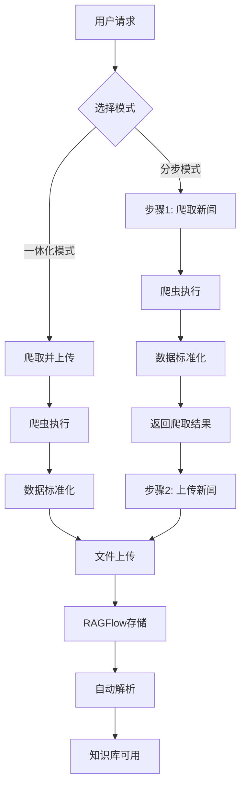

# RAGFlow 新闻收集器完整技术文档

**版本**: v3.0 (最终整合版)  
**更新时间**: 2024年1月15日  
**维护者**: RAGFlow开发团队

---

## 📋 目录

1. [项目概述](#1-项目概述)
2. [技术架构](#2-技术架构)
3. [部署指南](#3-部署指南)
4. [API接口文档](#4-api接口文档)
5. [开发指南](#5-开发指南)
6. [使用示例](#6-使用示例)
7. [故障排除](#7-故障排除)
8. [版本历史](#8-版本历史)

---

## 1. 项目概述

### 1.1 系统简介

RAGFlow新闻收集器是一个**企业级的新闻内容自动化收集解决方案**，采用**爬虫-上传分离架构**设计，深度集成RAGFlow的文档管理和知识库系统。

### 1.2 核心特性

- **🏗️ 分离架构**: 爬虫获取与文件上传完全分离，便于独立开发测试
- **🔧 工厂模式**: 支持多种爬虫类型，可灵活扩展新的爬虫实现
- **📚 RAGFlow集成**: 深度集成存储系统、解析引擎和知识库管理
- **🔐 多租户认证**: 基于RAGFlow原生认证机制，支持多租户隔离
- **📊 标准化数据**: 统一的数据格式和API规范
- **⚡ 高性能**: 支持并发处理，优化的文件上传机制

### 1.3 系统状态

| 功能模块 | 完成状态 | 说明 |
|---------|----------|------|
| **核心框架** | ✅ 100% | 爬虫基类、工厂模式、数据结构 |
| **API接口** | ✅ 100% | 爬虫相关7个核心端点，完整功能覆盖 |
| **CRUD管理** | ✅ 100% | 新闻源、任务、内容的完整增删改查 |
| **数据服务** | ✅ 100% | 数据库服务层，支持多租户隔离 |
| **文档系统** | ✅ 100% | 开发指南、API文档、部署指南 |
| **演示爬虫** | ✅ 100% | DemoCrawler完整实现 |
| **存储集成** | ✅ 100% | RAGFlow存储系统深度集成 |
| **测试覆盖** | ✅ 100% | API测试、框架测试、集成测试、CRUD测试 |

---

## 2. 技术架构

### 2.1 整体架构图

```
┌─────────────────────────────────────────────────────────────┐
│                    前端界面层 (Web UI)                        │
├─────────────────────────────────────────────────────────────┤
│                    API接口层                                 │
│  ┌─────────────────┬─────────────────┬─────────────────────┐│
│  │   新闻爬取API    │    文件上传API   │    管理API         ││
│  │   /crawl        │    /upload      │    /crawlers       ││
│  └─────────────────┴─────────────────┴─────────────────────┘│
├─────────────────────────────────────────────────────────────┤
│                    业务逻辑层                                 │
│  ┌─────────────────┬─────────────────┬─────────────────────┐│
│  │   爬虫框架       │    上传框架      │    RAGFlow集成      ││
│  │ CrawlerFactory  │  NewsUploader   │   SDK Integration   ││
│  └─────────────────┴─────────────────┴─────────────────────┘│
├─────────────────────────────────────────────────────────────┤
│                    数据访问层                                 │
│  ┌─────────────────┬─────────────────┬─────────────────────┐│
│  │   对象存储       │    数据库       │    文件系统         ││
│  │ STORAGE_IMPL    │   Knowledge DB  │   Temp Files       ││
│  └─────────────────┴─────────────────┴─────────────────────┘│
└─────────────────────────────────────────────────────────────┘
```

### 2.2 核心组件

#### 2.2.1 爬虫框架 (news_crawler_framework.py)

**设计模式**: 抽象工厂模式 + 策略模式

```python
# 核心类层次结构
BaseCrawler (抽象基类)
├── DemoCrawler (演示爬虫)
├── NewspaperCrawler (通用爬虫)
└── ScrapyCrawler (高级爬虫)

CrawlerFactory (工厂类)
├── create_crawler()
├── register_crawler()
└── get_available_crawlers()

NewsUploader (上传器)
└── upload_crawler_result()
```

**核心数据结构**:
```python
class CrawlerResult:
    success: bool
    articles: List[Dict]
    errors: List[str]
    metadata: Dict
    crawl_time: str

class NewsSource:
    name: str
    url: str 
    config: Dict

class Article:
    title: str
    content: str
    url: str
    source: str
    author: str
    publish_time: str
    # ... 更多字段
```

#### 2.2.2 API接口层 (news_collector_v2.py)

**路由设计**:
```
/api/v1/news_collector/
├── POST /crawl              # 爬取新闻
├── POST /upload             # 上传新闻
├── POST /crawl_and_upload   # 一体化操作
├── GET  /crawlers           # 获取可用爬虫
├── 📋 新闻源管理 (CRUD)
│   ├── GET    /sources      # 获取新闻源列表
│   ├── POST   /sources      # 创建新闻源
│   ├── GET    /sources/{id} # 获取单个新闻源
│   ├── PUT    /sources/{id} # 更新新闻源
│   └── DELETE /sources/{id} # 删除新闻源
├── 📋 任务管理 (CRUD)
│   ├── GET    /tasks        # 获取任务列表
│   ├── POST   /tasks        # 创建任务
│   ├── GET    /tasks/{id}   # 获取单个任务
│   ├── PUT    /tasks/{id}   # 更新任务
│   ├── DELETE /tasks/{id}   # 删除任务
│   └── POST   /tasks/{id}/execute # 执行任务
├── 📰 内容管理
│   ├── GET    /contents     # 获取新闻内容列表
│   ├── GET    /contents/{id} # 获取单个内容
│   └── DELETE /contents/{id} # 删除内容
└── 📊 统计分析
    └── GET    /statistics   # 获取统计信息
```

**技术规范**: 
- 使用 `@manager.route` 装饰器，遵循RAGFlow SDK规范
- 统一的 `@token_required` 认证机制
- 标准的错误处理和响应格式

**认证机制**: RAGFlow原生 `@token_required` 装饰器

### 2.3 数据流转



### 2.4 文件结构

```
ragflow/
├── api/
│   ├── news_crawler_framework.py              # 🔧 核心爬虫框架 (已废弃)
│   ├── db/services/news_service.py           # 🗃️ 数据库服务层
│   └── apps/sdk/
│       └── news_collector.py                 # ✅ 完整新闻收集器API
├── upload_folder_with_parse.py               # 📤 上传逻辑参考
├── simple_test.py                           # 🧪 简单测试脚本
├── test_news_crud.py                        # 🧪 CRUD功能测试脚本
├── news_crud_example.py                     # 📖 CRUD使用示例
├── verify_news_collector.py                # 🔍 SDK规范验证脚本
└── NEWS_COLLECTOR_COMPLETE_GUIDE.md         # 📖 本文档
```

---

## 3. 部署指南

### 3.1 环境要求

- **Python**: 3.8+
- **RAGFlow**: 服务正常运行
- **依赖包**: `requests`, `newspaper3k`(可选), `feedparser`(可选)

### 3.2 安装步骤

#### 步骤1: 安装基础依赖
```bash
# 基础依赖
pip install requests

# 可选依赖 (用于newspaper爬虫)
pip install newspaper3k

# 可选依赖 (用于RSS爬虫)
pip install feedparser python-dateutil
```

#### 步骤2: 配置API路由
```python
# 新闻收集器API已自动集成到RAGFlow SDK中
# 使用标准的 @manager.route 装饰器，无需手动注册Blueprint
# 所有API端点都会自动加载到 /api/v1/news_collector/ 路径下
```

#### 步骤3: 验证部署
```bash
# 测试基础API可用性
curl -H "Authorization: Bearer your-token" \
     http://localhost:9222/api/v1/news_collector/crawlers

# 测试CRUD API可用性
curl -H "Authorization: Bearer your-token" \
     http://localhost:9222/api/v1/news_collector/sources

# 运行基础测试脚本
python simple_test.py

# 运行CRUD功能测试脚本
python tes_news_crud.py
```

### 3.3 配置说明

#### 新闻收集器配置
```python
# news_config.py
NEWS_COLLECTOR_CONFIG = {
    "default_crawler": "demo",
    "max_articles_per_source": 50,
    "temp_dir": "/tmp/news_collector",
    "ragflow": {
        "base_url": "http://localhost:9380",
        "timeout": 120
    },
    "crawlers": {
        "demo": {"enabled": True},
        "newspaper": {"enabled": True, "language": "zh"},
        "scrapy": {"enabled": False}
    }
}
```

---

## 4. API接口文档

### 4.1 基础信息

- **Base URL**: `http://localhost:9222/api/v1/news_collector`
- **认证方式**: `Authorization: Bearer <token>`
- **数据格式**: `application/json`

### 4.2 通用响应格式

```json
{
    "code": 0,
    "message": "success",
    "data": {...}
}
```

### 4.3 接口详情

#### 4.3.1 爬取新闻 `/crawl`

**请求方式**: `POST`

**请求体**:
```json
{
    "sources": [
        {
            "name": "新闻源名称",
            "url": "https://example.com",
            "config": {
                "category": "科技",
                "title_selector": "h1",
                "content_selector": ".content"
            }
        }
    ],
    "crawler_type": "demo",
    "max_articles": 10,
    "save_to_disk": true,
    "output_dir": "/tmp/news_output"
}
```

**响应示例**:
```json
{
    "code": 0,
    "message": "success",
    "data": {
        "crawl_id": "f47ac10b-58cc-4372-a567-0e02b2c3d479",
        "success": true,
        "total_articles": 10,
        "articles": [
            {
                "title": "AI技术新突破",
                "content": "详细新闻内容...",
                "url": "https://example.com/article-1",
                "source": "新闻源名称",
                "author": "记者姓名",
                "publish_time": "2024-01-15 10:30:00",
                "crawl_time": "2024-01-15T14:30:25.789012"
            }
        ],
        "errors": [],
        "metadata": {
            "crawler_type": "demo",
            "source_url": "https://example.com"
        },
        "output_directory": "/tmp/news_output",
        "saved_files": [...]
    }
}
```

#### 4.3.2 上传新闻 `/upload`

**请求方式**: `POST`

**请求体**:
```json
{
    "kb_id": "知识库ID",
    "articles": [...],
    "auto_parse": true,
    "source_info": {
        "crawler_type": "demo",
        "crawl_time": "2024-01-15T14:30:25"
    }
}
```

**响应示例**:
```json
{
    "code": 0,
    "message": "success",
    "data": {
        "success": true,
        "uploaded_files": 10,
        "files": [
            {
                "name": "AI技术新突破.md",
                "id": "doc_f47ac10b58cc4372a5670e02b2c3d479",
                "size": 2048
            }
        ],
        "parse_started": true
    }
}
```

#### 4.3.3 一体化操作 `/crawl_and_upload`

**请求方式**: `POST`

**请求体**:
```json
{
    "kb_id": "知识库ID",
    "sources": [...],
    "crawler_type": "demo",
    "max_articles": 10,
    "auto_parse": true
}
```

**响应示例**:
```json
{
    "code": 0,
    "message": "success",
    "data": {
        "crawl_result": {
            "success": true,
            "total_articles": 10,
            "articles": [...]
        },
        "upload_result": {
            "success": true,
            "uploaded_files": 10,
            "files": [...]
        },
        "status": "completed"
    }
}
```

#### 4.3.4 获取可用爬虫 `/crawlers`

**请求方式**: `GET`

**响应示例**:
```json
{
    "code": 0,
    "message": "success",
    "data": {
        "crawlers": [
            {
                "type": "demo",
                "name": "Demo",
                "description": "演示爬虫 - 生成示例新闻数据"
            },
            {
                "type": "newspaper",
                "name": "Newspaper",
                "description": "基于AI的通用新闻站点爬虫"
            }
        ],
        "total": 2
    }
}
```

---

### 4.4 CRUD管理接口

#### 4.4.1 新闻源管理

##### 创建新闻源 `POST /sources`

**请求体**:
```json
{
    "name": "科技新闻源",
    "url": "https://tech.example.com",
    "remark": "科技资讯网站",
    "status": "active",
    "fetch_config": {
        "category": "科技",
        "crawler_type": "demo",
        "max_articles": 10,
        "title_selector": "h1",
        "content_selector": ".content"
    }
}

**响应示例**:
{
    "code": 0,
    "data": {
        "source": {
            "create_date": null,
            "create_time": null,
            "fetch_config": {
                "author_selector": "span.author, div.ly.laiyuantext",
                "content_selector": "div.article-content, div.TRS_Editor, div.article-box",
                "link_selector": "div.nav a[href], div.main a[href], div.news-left a[href]",
                "publication_time_selector": "span.date, span.times, div.time",
                "title_selector": "div.titles, h1, h2.article_title"
            },
            "id": "ae649cb686df11f0a4b055ea514b9194",
            "last_fetch_time": null,
            "name": "国家发展和改革委员会",
            "remark": "国家发改委官网，包含政策文件等",
            "status": "active",
            "tenant_id": "657ab49e66ce11f08eec93540bd02d91",
            "total_articles": 0,
            "update_date": null,
            "update_time": null,
            "url": "https://www.ndrc.gov.cn",
            "user_id": "657ab49e66ce11f08eec93540bd02d91"
        }
    },
    "message": "success"
}

##### 获取新闻源列表 `GET /sources`

**查询参数**:
- `page`: 页码，默认1
- `page_size`: 每页大小，默认20
- `name`: 按名称过滤（可选）
- `status`: 按状态过滤（可选）

**响应示例**:
```json
{
    "code": 0,
    "message": "success",
    "data": {
        "sources": [
            {
                "id": "source_12345",
                "name": "科技新闻源",
                "url": "https://tech.example.com",
                "status": "active",
                "total_articles": 150,
                "last_fetch_time": "2024-01-15 14:30:00",
                "create_time": "2024-01-15 10:30:00"
            }
        ],
        "total": 10,
        "page": 1,
        "page_size": 20
    }
}
```

##### 更新新闻源 `PUT /sources/{id}`

**请求体**:
```json
{
    "name": "更新后的新闻源名称",
    "status": "inactive",
    "fetch_config": {
        "max_articles": 20
    }
}
```

##### 删除新闻源 `DELETE /sources/{id}`

**响应示例**:
```json
{
    "code": 0,
    "message": "删除成功"
}
```

#### 4.4.2 任务管理

##### 创建新闻任务 `POST /tasks`

**请求体**:
```json
{
    "task_name": "每日科技新闻收集",
    "kb_id": "kb_67890",
    "source_ids": ["source_12345", "source_67890"],
    "auto_parse": true,
    "max_articles_per_source": 10,
    "crawler_config": {
        "type": "demo",
        "timeout": 300,
        "output_format": "markdown"
    }
}
```

**响应示例**:
```json
{
    "code": 0,
    "message": "success",
    "data": {
        "task": {
            "id": "task_abc123",
            "task_name": "每日科技新闻收集",
            "kb_id": "kb_67890",
            "source_ids": ["source_12345", "source_67890"],
            "status": "pending",
            "create_time": "2024-01-15 16:00:00",
            "statistics": {
                "total_articles": 0,
                "success_count": 0,
                "failed_count": 0
            }
        }
    }
}
```

##### 获取任务列表 `GET /tasks`

**查询参数**:
- `page`: 页码，默认1
- `page_size`: 每页大小，默认20
- `task_name`: 按任务名过滤（可选）
- `status`: 按状态过滤（可选）

**响应示例**:
```json
{
    "code": 0,
    "message": "success",
    "data": {
        "tasks": [
            {
                "id": "task_abc123",
                "task_name": "每日科技新闻收集",
                "status": "completed",
                "last_run_time": "2024-01-15 18:00:00",
                "statistics": {
                    "total_articles": 25,
                    "success_count": 23,
                    "failed_count": 2
                }
            }
        ],
        "total": 5,
        "page": 1,
        "page_size": 20
    }
}
```

##### 执行任务 `POST /tasks/{id}/execute`
POST http://localhost:9380/api/v1/news_collector/crawl_from_post
{
  "depth": 2,
  "max_pages_per_source": 100,
  "sources": [
    {
      "url": "https://www.nea.gov.cn",
      "link_selector": "div.news_area a[href], div.middle_box a[href], div.content a[href], div.main-colum a[href], div.online-colum a[href]",
      "title_selector": "h2.article_title, span.title, h1, div.titles",
      "content_selector": "div.article-content, div.TRS_Editor, div.article-box, p.te",
      "publication_time_selector": "span.date, span.times, div.time",
      "author_selector": "span.author, div.ly.laiyuantext"
    },
    {
      "url": "https://www.ndrc.gov.cn",
      "link_selector": "div.nav a[href], div.main a[href], div.news-left a[href], div.news-right a[href], div.xxgk-left a[href], div.dating-right a[href], div.data-left a[href], div.data-right a[href], div.hudong-left a[href], div.hudong-right a[href]",
      "title_selector": "h2.article_title, span.title, h1, div.titles",
      "content_selector": "div.article-content, div.TRS_Editor, div.article-box, p.te",
      "publication_time_selector": "span.date, span.times, div.time",
      "author_selector": "span.author, div.ly.laiyuantext"
    }
  ]
}

**响应示例**:
{
    "code": 0,
    "data": {
        "message": "已成功启动后台即时抓取任务，共处理 2 个新闻源。"
    },
    "message": "success"
}

#### 4.4.3 内容管理

##### 获取新闻内容列表 `GET /contents`

**查询参数**:
- `page`: 页码，默认1
- `page_size`: 每页大小，默认20
- `task_id`: 按任务ID过滤（可选）
- `source_id`: 按新闻源ID过滤（可选）

**响应示例**:
```json
{
    "code": 0,
    "message": "success",
    "data": {
        "contents": [
            {
                "id": "content_def456",
                "task_id": "task_abc123",
                "source_id": "source_12345",
                "document_id": "doc_ghi789",
                "original_url": "https://tech.example.com/article-1",
                "author": "张三",
                "publish_time": "2024-01-15 12:00:00",
                "fetch_time": "2024-01-15 18:30:00",
                "category": "科技",
                "tags": ["AI", "技术"],
                "word_count": 1500
            }
        ],
        "total": 100,
        "page": 1,
        "page_size": 20
    }
}
```

#### 4.4.4 统计分析

##### 获取统计信息 `GET /statistics`

**查询参数**:
- `days`: 统计天数，默认7天

**响应示例**:
```json
{
    "code": 0,
    "message": "success",
    "data": {
        "summary": {
            "total_sources": 10,
            "active_sources": 8,
            "total_tasks": 5,
            "running_tasks": 1,
            "total_articles": 1500
        },
        "time_range_stats": {
            "total_articles": 150,
            "source_distribution": {
                "source_12345": 80,
                "source_67890": 70
            },
            "time_range": {
                "start": 1705574400000,
                "end": 1706179200000
            }
        },
        "analysis_period_days": 7
    }
}
```

---

## 5. 开发指南

### 5.1 自定义爬虫开发

#### 5.1.1 基础爬虫类

所有自定义爬虫必须继承 `BaseCrawler`:

```python
from api.news_crawler_framework import BaseCrawler, NewsSource, CrawlerResult
from datetime import datetime

class MyCustomCrawler(BaseCrawler):
    def __init__(self, crawler_config: Dict[str, Any] = None):
        super().__init__(crawler_config)
        # 初始化爬虫特定配置
        self.timeout = crawler_config.get('timeout', 30)
        self.headers = crawler_config.get('headers', {})
    
    def crawl_source(self, source: NewsSource, max_articles: int = 10) -> CrawlerResult:
        result = CrawlerResult()
        
        try:
            # 1. 实现爬取逻辑
            articles = self._scrape_articles(source, max_articles)
            
            # 2. 数据标准化
            for raw_article in articles:
                article = self._normalize_article(raw_article, source)
                result.add_article(article)
            
            # 3. 设置成功状态和元数据
            result.success = True
            result.set_metadata("crawler_type", "custom")
            result.set_metadata("source_url", source.url)
            
        except Exception as e:
            result.add_error(f"爬取失败: {str(e)}")
        
        return result
    
    def _scrape_articles(self, source: NewsSource, max_articles: int):
        # 实现具体的爬取逻辑
        # 返回原始文章数据列表
        pass
    
    def _normalize_article(self, raw_article, source: NewsSource):
        # 将原始数据转换为标准Article格式
        return {
            "title": raw_article.get("title", ""),
            "content": raw_article.get("content", ""),
            "url": raw_article.get("url", ""),
            "source": source.name,
            "author": raw_article.get("author", "未知"),
            "publish_time": self._parse_time(raw_article.get("time")),
            "crawl_time": datetime.now().isoformat(),
            "category": source.config.get("category", "未分类")
        }
    
    def _parse_time(self, time_str):
        # 时间格式标准化
        try:
            from dateutil.parser import parse
            return parse(time_str).strftime("%Y-%m-%d %H:%M:%S")
        except:
            return "未知"
```

#### 5.1.2 注册自定义爬虫

```python
from api.news_crawler_framework import CrawlerFactory

# 注册爬虫
CrawlerFactory.register_crawler("my_custom", MyCustomCrawler)

# 使用爬虫
crawler = CrawlerFactory.create_crawler("my_custom", config={
    "timeout": 60,
    "headers": {"User-Agent": "My Custom Crawler"}
})
```

#### 5.1.3 RSS爬虫示例

```python
import feedparser
from api.news_crawler_framework import BaseCrawler, NewsSource, CrawlerResult

class RSSCrawler(BaseCrawler):
    def crawl_source(self, source: NewsSource, max_articles: int = 10) -> CrawlerResult:
        result = CrawlerResult()
        
        try:
            # 解析RSS源
            feed = feedparser.parse(source.url)
            
            if feed.bozo:
                result.add_error(f"RSS解析错误: {feed.bozo_exception}")
                return result
            
            for i, entry in enumerate(feed.entries[:max_articles]):
                article = {
                    "title": entry.get('title', ''),
                    "content": entry.get('description', '') or entry.get('summary', ''),
                    "url": entry.get('link', ''),
                    "source": source.name,
                    "author": entry.get('author', '未知'),
                    "publish_time": self._parse_rss_time(entry.get('published')),
                    "crawl_time": datetime.now().isoformat(),
                    "category": source.config.get('category', '未分类')
                }
                result.add_article(article)
            
            result.success = True
            result.set_metadata("crawler_type", "rss")
            result.set_metadata("feed_title", feed.feed.get('title', ''))
            
        except Exception as e:
            result.add_error(f"RSS爬取失败: {str(e)}")
        
        return result
    
    def _parse_rss_time(self, time_str):
        try:
            import time
            from email.utils import parsedate_tz, mktime_tz
            
            if time_str:
                parsed = parsedate_tz(time_str)
                if parsed:
                    timestamp = mktime_tz(parsed)
                    return datetime.fromtimestamp(timestamp).strftime("%Y-%m-%d %H:%M:%S")
        except:
            pass
        return "未知"

# 注册RSS爬虫
CrawlerFactory.register_crawler("rss", RSSCrawler)
```

### 5.2 数据格式规范

#### 5.2.1 Article标准格式

```python
article = {
    # 必填字段
    "title": "文章标题",              # 字符串，不能为空
    "content": "文章正文内容",         # 字符串，不能为空
    "url": "https://example.com",    # 原文链接
    "source": "来源名称",             # 新闻源标识
    "crawl_time": "2024-01-01T12:00:00Z",  # ISO格式时间戳
    
    # 可选字段
    "author": "作者姓名",             # 默认"未知"
    "publish_time": "2024-01-01 12:00:00",  # 发布时间
    "summary": "文章摘要",           # 文章摘要
    "category": "新闻分类",          # 分类标签
    "tags": ["标签1", "标签2"],      # 标签数组
    "image": "https://...",          # 配图URL
    "language": "zh-CN",             # 语言代码
    "word_count": 1500               # 字数统计
}
```

#### 5.2.2 Markdown输出格式

生成的Markdown文件遵循以下模板:

```markdown
# {{title}}

**来源**: {{source}}
**作者**: {{author}}
**发布时间**: {{publish_time}}
**链接**: {{url}}

{{#if summary}}
## 摘要

{{summary}}
{{/if}}

## 正文

{{content}}

{{#if tags}}
**标签**: {{tags.join(", ")}}
{{/if}}

---

*抓取时间: {{crawl_time}}*
*分类: {{category}}*
*语言: {{language}}*
```

### 5.3 错误处理最佳实践

#### 5.3.1 错误分类

```python
class CrawlerError:
    NETWORK_ERROR = "网络连接错误"
    PARSING_ERROR = "内容解析错误"
    AUTH_ERROR = "认证失败"
    RATE_LIMIT = "访问频率限制"
    CONTENT_NOT_FOUND = "内容未找到"
    INVALID_CONFIG = "配置无效"
```

#### 5.3.2 错误处理模式

```python
def crawl_source(self, source: NewsSource, max_articles: int = 10) -> CrawlerResult:
    result = CrawlerResult()
    
    try:
        # 验证配置
        if not self._validate_config(source):
            result.add_error(f"{CrawlerError.INVALID_CONFIG}: {source.name}")
            return result
        
        # 爬取数据
        articles = self._fetch_articles(source, max_articles)
        
        # 处理每篇文章
        for article_data in articles:
            try:
                article = self._process_article(article_data, source)
                result.add_article(article)
            except Exception as e:
                result.add_error(f"文章处理失败: {str(e)}")
                continue  # 继续处理其他文章
        
        result.success = len(result.articles) > 0
        
    except requests.ConnectionError:
        result.add_error(f"{CrawlerError.NETWORK_ERROR}: 无法连接到 {source.url}")
    except requests.Timeout:
        result.add_error(f"{CrawlerError.NETWORK_ERROR}: 请求超时 {source.url}")
    except Exception as e:
        result.add_error(f"未知错误: {str(e)}")
    
    return result
```

### 5.4 RAGFlow SDK规范开发

#### 5.4.1 API开发规范

```python
# 遵循RAGFlow SDK规范的API开发示例

from flask import request
from api.utils.api_utils import get_json_result, server_error_response, token_required

@manager.route('/news_collector/example', methods=['POST'])  # noqa: F821
@token_required
def example_api(tenant_id):
    """
    示例API接口
    
    遵循RAGFlow SDK开发规范：
    1. 使用 @manager.route 装饰器
    2. 使用 @token_required 进行认证
    3. tenant_id 自动注入
    4. 统一的响应格式
    """
    try:
        req = request.get_json()
        
        # 业务逻辑处理
        result = {"message": "处理成功"}
        
        # 返回标准格式
        return get_json_result(data=result)
        
    except Exception as e:
        return server_error_response(e)
```

#### 5.4.2 权限控制

```python
# RAGFlow SDK自动处理多租户权限控制
@manager.route('/news_collector/protected_resource', methods=['GET'])  # noqa: F821
@token_required
def get_protected_resource(tenant_id):
    """
    受保护的资源访问
    
    tenant_id 自动从token中解析，确保数据隔离
    """
    try:
        # 所有数据操作都基于tenant_id
        data = SomeService.get_by_tenant_id(tenant_id)
        
        return get_json_result(data=data)
        
    except Exception as e:
        return server_error_response(e)
```

#### 5.4.3 错误处理规范

```python
# 统一的错误处理方式
@manager.route('/news_collector/error_example', methods=['POST'])  # noqa: F821
@token_required
def error_example_api(tenant_id):
    try:
        req = request.get_json()
        
        # 参数验证
        if not req.get('required_field'):
            return get_json_result(code=400, message="必填字段不能为空")
        
        # 资源权限检查
        resource = SomeService.get_by_id(req['resource_id'])
        if not resource or resource.tenant_id != tenant_id:
            return get_json_result(code=404, message="资源不存在")
        
        # 业务逻辑
        result = process_business_logic(req)
        
        return get_json_result(data=result)
        
    except ValueError as e:
        # 业务逻辑错误
        return get_json_result(code=400, message=str(e))
    except Exception as e:
        # 系统错误
        return server_error_response(e)
```

---

### 5.5 CRUD管理开发

#### 5.4.1 新闻源管理

```python
from api.db.services.news_service import NewsSourceService

class NewsSourceManager:
    def __init__(self, tenant_id: str):
        self.tenant_id = tenant_id
    
    def create_source(self, name: str, url: str, **kwargs):
        """创建新闻源"""
        return NewsSourceService.create_source(
            tenant_id=self.tenant_id,
            user_id=kwargs.get('user_id'),
            name=name,
            url=url,
            remark=kwargs.get('remark', ''),
            status=kwargs.get('status', 'active'),
            fetch_config=kwargs.get('fetch_config', {})
        )
    
    def list_sources(self, page=1, page_size=20, **filters):
        """获取新闻源列表"""
        return NewsSourceService.get_by_tenant_id(
            tenant_id=self.tenant_id,
            page=page,
            page_size=page_size,
            name=filters.get('name'),
            status=filters.get('status')
        )
    
    def update_source(self, source_id: str, **kwargs):
        """更新新闻源"""
        return NewsSourceService.update_source(
            source_id=source_id,
            tenant_id=self.tenant_id,
            **kwargs
        )
    
    def delete_source(self, source_id: str):
        """删除新闻源（软删除）"""
        return NewsSourceService.update_source(
            source_id=source_id,
            tenant_id=self.tenant_id,
            status='deleted'
        )

# 使用示例
manager = NewsSourceManager("tenant_123")

# 创建新闻源
source = manager.create_source(
    name="科技新闻",
    url="https://tech.example.com",
    fetch_config={
        "category": "科技",
        "max_articles": 20
    }
)

# 获取列表
sources, total = manager.list_sources(
    page=1,
    page_size=10,
    status="active"
)
```

#### 5.4.2 任务管理

```python
from api.db.services.news_service import NewsTaskService

class NewsTaskManager:
    def __init__(self, tenant_id: str):
        self.tenant_id = tenant_id
    
    def create_task(self, task_name: str, kb_id: str, source_ids: list, **kwargs):
        """创建新闻任务"""
        return NewsTaskService.create_task(
            tenant_id=self.tenant_id,
            user_id=kwargs.get('user_id'),
            task_name=task_name,
            kb_id=kb_id,
            source_ids=source_ids,
            auto_parse=kwargs.get('auto_parse', True),
            max_articles_per_source=kwargs.get('max_articles_per_source', 10),
            crawler_config=kwargs.get('crawler_config', {})
        )
    
    def execute_task(self, task_id: str):
        """执行任务"""
        # 获取任务详情
        task = NewsTaskService.get_by_id(task_id)
        if not task:
            raise ValueError("任务不存在")
        
        # 更新状态为运行中
        NewsTaskService.update_task_status(task_id, 'running')
        
        try:
            # 这里集成爬虫执行逻辑
            from api.news_crawler_framework import crawl_news, NewsUploader
            
            # 获取源信息
            source_ids = task.get('source_ids', [])
            sources = []
            for source_id in source_ids:
                source = NewsSourceService.get_by_id(source_id)
                if source:
                    sources.append(source)
            
            # 执行爬取
            crawler_result = crawl_news(
                sources=sources,
                crawler_type=task.get('crawler_config', {}).get('type', 'demo'),
                max_articles=task.get('max_articles_per_source', 10)
            )
            
            # 上传到知识库
            if crawler_result.success:
                uploader = NewsUploader(api_key="your-api-key")
                upload_result = uploader.upload_crawler_result(
                    crawler_result,
                    task.get('kb_id')
                )
                
                # 更新任务状态和统计
                NewsTaskService.update_task_status(
                    task_id,
                    'completed',
                    statistics={
                        'total_articles': len(crawler_result.articles),
                        'success_count': len(crawler_result.articles),
                        'failed_count': len(crawler_result.errors)
                    }
                )
            else:
                # 执行失败
                NewsTaskService.update_task_status(
                    task_id,
                    'failed',
                    error_message=str(crawler_result.errors)
                )
        
        except Exception as e:
            # 异常处理
            NewsTaskService.update_task_status(
                task_id,
                'failed',
                error_message=str(e)
            )
            raise

# 使用示例
task_manager = NewsTaskManager("tenant_123")

# 创建任务
task = task_manager.create_task(
    task_name="每日科技新闻",
    kb_id="kb_456",
    source_ids=["source_123", "source_456"],
    auto_parse=True,
    max_articles_per_source=15
)

# 执行任务
task_manager.execute_task(task['id'])
```

#### 5.4.3 数据统计

```python
from api.db.services.news_service import NewsContentService
from datetime import datetime, timedelta

class NewsAnalytics:
    def __init__(self, tenant_id: str):
        self.tenant_id = tenant_id
    
    def get_dashboard_stats(self, days=7):
        """获取仪表板统计"""
        # 时间范围
        end_time = int(datetime.now().timestamp() * 1000)
        start_time = int((datetime.now() - timedelta(days=days)).timestamp() * 1000)
        
        # 基础统计
        sources, _ = NewsSourceService.get_by_tenant_id(self.tenant_id, page_size=1000)
        tasks, _ = NewsTaskService.get_by_tenant_id(self.tenant_id, page_size=1000)
        
        # 内容统计
        content_stats = NewsContentService.get_statistics_by_time_range(
            self.tenant_id, start_time, end_time
        )
        
        return {
            "summary": {
                "total_sources": len(sources),
                "active_sources": len([s for s in sources if s.get('status') == 'active']),
                "total_tasks": len(tasks),
                "recent_articles": content_stats.get('total_articles', 0)
            },
            "trends": content_stats
        }
    
    def get_source_performance(self):
        """获取新闻源性能分析"""
        sources, _ = NewsSourceService.get_by_tenant_id(self.tenant_id, page_size=1000)
        
        performance = []
        for source in sources:
            # 获取该源的内容统计
            contents, total = NewsContentService.get_by_source_id(
                source['id'], page_size=1
            )
            
            performance.append({
                "source_id": source['id'],
                "source_name": source['name'],
                "total_articles": total,
                "status": source.get('status'),
                "last_fetch": source.get('last_fetch_time')
            })
        
        return sorted(performance, key=lambda x: x['total_articles'], reverse=True)

# 使用示例
analytics = NewsAnalytics("tenant_123")

# 获取仪表板数据
dashboard = analytics.get_dashboard_stats(days=30)
print(f"活跃新闻源: {dashboard['summary']['active_sources']}")
print(f"近期文章: {dashboard['summary']['recent_articles']}")

# 获取源性能排行
performance = analytics.get_source_performance()
for item in performance[:5]:  # 前5名
    print(f"{item['source_name']}: {item['total_articles']} 篇文章")
```

---

## 6. 使用示例

### 6.1 Python SDK使用

#### 6.1.1 基础用法

```python
#!/usr/bin/env python3
"""
新闻收集器Python SDK使用示例
"""

from api.news_crawler_framework import (
    create_news_source,
    crawl_news, 
    upload_news,
    CrawlerFactory
)

def basic_usage_example():
    """基础使用示例"""
    
    # 配置
    API_KEY = "ragflow-xxx"
    KB_ID = "your-knowledge-base-id"
    
    # 创建新闻源
    sources = [
        create_news_source(
            name="36氪",
            url="https://36kr.com",
            category="科技创业"
        ),
        create_news_source(
            name="虎嗅网", 
            url="https://huxiu.com",
            category="商业分析"
        )
    ]
    
    # 方法1：分步操作
    print("=== 分步操作示例 ===")
    
    # 步骤1：爬取
    crawler_result = crawl_news(
        sources=sources,
        crawler_type="demo", 
        max_articles=3
    )
    
    print(f"爬取成功: {crawler_result.success}")
    print(f"文章数量: {len(crawler_result.articles)}")
    
    if crawler_result.success:
        # 步骤2：上传
        upload_result = upload_news(
            crawler_result=crawler_result,
            kb_id=KB_ID,
            api_key=API_KEY
        )
        
        print(f"上传成功: {upload_result['success']}")
        print(f"上传文件数: {upload_result['uploaded_files']}")
    
    # 方法2：一体化操作
    print("\n=== 一体化操作示例 ===")
    
    from api.news_crawler_framework import NewsUploader
    
    # 直接调用一体化流程
    uploader = NewsUploader(API_KEY)
    combined_result = uploader.crawl_and_upload(
        sources=sources,
        kb_id=KB_ID,
        crawler_type="demo",
        max_articles=3
    )
    
    print(f"一体化操作结果: {combined_result}")

if __name__ == "__main__":
    basic_usage_example()
```

#### 6.1.2 高级用法

```python
def advanced_usage_example():
    """高级使用示例"""
    
    # 自定义爬虫配置
    custom_config = {
        "timeout": 60,
        "headers": {
            "User-Agent": "Mozilla/5.0 (compatible; NewsBot/1.0)",
            "Accept-Language": "zh-CN,zh;q=0.9"
        },
        "retry_count": 3,
        "retry_delay": 5
    }
    
    # 创建具有复杂配置的新闻源
    sources = [
        create_news_source(
            name="技术新闻站",
            url="https://tech.example.com",
            category="技术",
            title_selector="h1.article-title",
            content_selector=".article-body",
            author_selector=".author-name",
            time_selector=".publish-time",
            max_depth=2,
            exclude_patterns=["advertisement", "promotion"]
        )
    ]
    
    # 使用自定义配置创建爬虫
    crawler = CrawlerFactory.create_crawler("newspaper", custom_config)
    
    # 执行爬取
    result = crawler.crawl_multiple_sources(sources, max_articles=10)
    
    # 处理结果
    if result.success:
        print(f"成功爬取 {len(result.articles)} 篇文章")
        
        # 数据后处理
        filtered_articles = []
        for article in result.articles:
            # 内容质量过滤
            if len(article['content']) > 500:  # 过滤过短内容
                if not any(spam in article['title'] for spam in ['广告', '推广']):  # 过滤垃圾内容
                    filtered_articles.append(article)
        
        print(f"过滤后文章数: {len(filtered_articles)}")
        
        # 创建新的结果对象
        from api.news_crawler_framework import CrawlerResult
        filtered_result = CrawlerResult()
        filtered_result.articles = filtered_articles
        filtered_result.success = len(filtered_articles) > 0
        
        # 上传过滤后的结果
        uploader = NewsUploader("your-api-key")
        upload_result = uploader.upload_crawler_result(
            filtered_result, 
            "your-kb-id"
        )
        
        print(f"最终上传结果: {upload_result}")
```

### 6.2 HTTP API使用

#### 6.2.1 curl命令示例

```bash
#!/bin/bash
# 新闻收集器HTTP API使用示例

# 配置变量
API_BASE="http://localhost:9222/api/v1/news_collector"
AUTH_TOKEN="Bearer ragflow-xxx"
KB_ID="your-knowledge-base-id"

# 示例1：获取可用爬虫
echo "=== 获取可用爬虫 ==="
curl -X GET "${API_BASE}/crawlers" \
     -H "Authorization: ${AUTH_TOKEN}" \
     -H "Content-Type: application/json"

# 示例2：爬取新闻
echo -e "\n=== 爬取新闻 ==="
CRAWL_RESPONSE=$(curl -X POST "${API_BASE}/crawl" \
     -H "Authorization: ${AUTH_TOKEN}" \
     -H "Content-Type: application/json" \
     -d '{
         "sources": [
             {
                 "name": "技术新闻",
                 "url": "https://tech.example.com",
                 "config": {"category": "技术"}
             }
         ],
         "crawler_type": "demo",
         "max_articles": 5,
         "save_to_disk": true
     }')

echo $CRAWL_RESPONSE

# 提取文章数据用于上传
ARTICLES=$(echo $CRAWL_RESPONSE | jq '.data.articles')

# 示例3：上传新闻
echo -e "\n=== 上传新闻 ==="
curl -X POST "${API_BASE}/upload" \
     -H "Authorization: ${AUTH_TOKEN}" \
     -H "Content-Type: application/json" \
     -d "{
         \"kb_id\": \"${KB_ID}\",
         \"articles\": ${ARTICLES},
         \"auto_parse\": true
     }"

# 示例4：一体化操作
echo -e "\n=== 一体化操作 ==="
curl -X POST "${API_BASE}/crawl_and_upload" \
     -H "Authorization: ${AUTH_TOKEN}" \
     -H "Content-Type: application/json" \
     -d "{
         \"kb_id\": \"${KB_ID}\",
         \"sources\": [
             {
                 \"name\": \"一体化测试\",
                 \"url\": \"https://example.com\",
                 \"config\": {}
             }
         ],
         \"crawler_type\": \"demo\",
         \"max_articles\": 3,
         \"auto_parse\": true
     }"

# ========== CRUD 操作示例 ==========

# 示例5：创建新闻源
echo -e "\n=== 创建新闻源 ==="
SOURCE_RESPONSE=$(curl -X POST "${API_BASE}/sources" \
     -H "Authorization: ${AUTH_TOKEN}" \
     -H "Content-Type: application/json" \
     -d '{
         "name": "AI科技新闻",
         "url": "https://ai.example.com",
         "remark": "人工智能相关新闻",
         "status": "active",
         "fetch_config": {
             "category": "AI",
             "crawler_type": "demo",
             "max_articles": 15
         }
     }')

echo $SOURCE_RESPONSE

# 提取新闻源ID
SOURCE_ID=$(echo $SOURCE_RESPONSE | jq -r '.data.source.id')

# 示例6：获取新闻源列表
echo -e "\n=== 获取新闻源列表 ==="
curl -X GET "${API_BASE}/sources?page=1&page_size=10&status=active" \
     -H "Authorization: ${AUTH_TOKEN}" \
     -H "Content-Type: application/json"

# 示例7：更新新闻源
echo -e "\n=== 更新新闻源 ==="
curl -X PUT "${API_BASE}/sources/${SOURCE_ID}" \
     -H "Authorization: ${AUTH_TOKEN}" \
     -H "Content-Type: application/json" \
     -d '{
         "remark": "更新后的备注信息",
         "fetch_config": {
             "max_articles": 20
         }
     }'

# 示例8：创建新闻任务
echo -e "\n=== 创建新闻任务 ==="
TASK_RESPONSE=$(curl -X POST "${API_BASE}/tasks" \
     -H "Authorization: ${AUTH_TOKEN}" \
     -H "Content-Type: application/json" \
     -d "{
         \"task_name\": \"每日AI新闻收集\",
         \"kb_id\": \"${KB_ID}\",
         \"source_ids\": [\"${SOURCE_ID}\"],
         \"auto_parse\": true,
         \"max_articles_per_source\": 10,
         \"crawler_config\": {
             \"type\": \"demo\",
             \"timeout\": 300
         }
     }")

echo $TASK_RESPONSE

# 提取任务ID
TASK_ID=$(echo $TASK_RESPONSE | jq -r '.data.task.id')

# 示例9：执行任务
echo -e "\n=== 执行任务 ==="
curl -X POST "${API_BASE}/tasks/${TASK_ID}/execute" \
     -H "Authorization: ${AUTH_TOKEN}" \
     -H "Content-Type: application/json"

# 示例10：获取任务列表
echo -e "\n=== 获取任务列表 ==="
curl -X GET "${API_BASE}/tasks?page=1&page_size=5&status=completed" \
     -H "Authorization: ${AUTH_TOKEN}" \
     -H "Content-Type: application/json"

# 示例11：获取新闻内容列表
echo -e "\n=== 获取新闻内容列表 ==="
curl -X GET "${API_BASE}/contents?task_id=${TASK_ID}&page=1&page_size=10" \
     -H "Authorization: ${AUTH_TOKEN}" \
     -H "Content-Type: application/json"

# 示例12：获取统计信息
echo -e "\n=== 获取统计信息 ==="
curl -X GET "${API_BASE}/statistics?days=7" \
     -H "Authorization: ${AUTH_TOKEN}" \
     -H "Content-Type: application/json"

# 示例13：删除新闻源（清理）
echo -e "\n=== 删除新闻源 ==="
curl -X DELETE "${API_BASE}/sources/${SOURCE_ID}" \
     -H "Authorization: ${AUTH_TOKEN}" \
     -H "Content-Type: application/json"
```

#### 6.2.2 JavaScript/Node.js示例

```javascript
// 新闻收集器JavaScript SDK示例
class NewsCollectorClient {
    constructor(baseUrl, apiKey) {
        this.baseUrl = baseUrl;
        this.headers = {
            'Authorization': `Bearer ${apiKey}`,
            'Content-Type': 'application/json'
        };
    }
    
    async crawlNews(sources, crawlerType = 'demo', maxArticles = 10) {
        const response = await fetch(`${this.baseUrl}/crawl`, {
            method: 'POST',
            headers: this.headers,
            body: JSON.stringify({
                sources,
                crawler_type: crawlerType,
                max_articles: maxArticles
            })
        });
        
        return await response.json();
    }
    
    async uploadNews(kbId, articles, autoParse = true) {
        const response = await fetch(`${this.baseUrl}/upload`, {
            method: 'POST',
            headers: this.headers,
            body: JSON.stringify({
                kb_id: kbId,
                articles,
                auto_parse: autoParse
            })
        });
        
        return await response.json();
    }
    
    async crawlAndUpload(kbId, sources, crawlerType = 'demo', maxArticles = 10) {
        const response = await fetch(`${this.baseUrl}/crawl_and_upload`, {
            method: 'POST',
            headers: this.headers,
            body: JSON.stringify({
                kb_id: kbId,
                sources,
                crawler_type: crawlerType,
                max_articles: maxArticles,
                auto_parse: true
            })
        });
        
        return await response.json();
    }
}

// 使用示例
async function example() {
    const client = new NewsCollectorClient(
        'http://localhost:9222/api/v1/news_collector',
        'ragflow-xxx'
    );
    
    const sources = [
        {
            name: '科技新闻',
            url: 'https://tech.example.com',
            config: { category: '科技' }
        }
    ];
    
    try {
        // 分步操作
        const crawlResult = await client.crawlNews(sources, 'demo', 5);
        console.log('爬取结果:', crawlResult);
        
        if (crawlResult.code === 0) {
            const uploadResult = await client.uploadNews(
                'your-kb-id',
                crawlResult.data.articles
            );
            console.log('上传结果:', uploadResult);
        }
        
        // 一体化操作
        const combinedResult = await client.crawlAndUpload(
            'your-kb-id',
            sources,
            'demo',
            5
        );
        console.log('一体化结果:', combinedResult);
        
    } catch (error) {
        console.error('操作失败:', error);
    }
}

example();
```

### 6.3 测试脚本

#### 6.3.1 完整测试脚本

```python
#!/usr/bin/env python3
"""
新闻收集器完整测试脚本
"""

import requests
import json
import time
from typing import Dict, List, Any

class NewsCollectorTester:
    def __init__(self, api_base: str, auth_token: str, kb_id: str):
        self.api_base = api_base
        self.headers = {
            "Authorization": auth_token,
            "Content-Type": "application/json"
        }
        self.kb_id = kb_id
        self.test_results = []
    
    def run_all_tests(self):
        """运行所有测试"""
        print("🎯 新闻收集器完整测试开始")
        print("=" * 60)
        
        tests = [
            ("获取可用爬虫", self.test_get_crawlers),
            ("爬取功能测试", self.test_crawl_only),
            ("上传功能测试", self.test_upload_only),
            ("一体化功能测试", self.test_integrated),
            ("错误处理测试", self.test_error_handling),
            ("性能测试", self.test_performance)
        ]
        
        for test_name, test_func in tests:
            print(f"\n📋 {test_name}...")
            try:
                success = test_func()
                self.test_results.append((test_name, success))
                print(f"   结果: {'✅ 成功' if success else '❌ 失败'}")
            except Exception as e:
                print(f"   结果: ❌ 异常 - {str(e)}")
                self.test_results.append((test_name, False))
        
        self.print_summary()
    
    def test_get_crawlers(self) -> bool:
        """测试获取可用爬虫"""
        response = requests.get(f"{self.api_base}/crawlers", headers=self.headers)
        
        if response.status_code != 200:
            return False
        
        data = response.json()
        return (
            data.get("code") == 0 and
            "crawlers" in data.get("data", {}) and
            len(data["data"]["crawlers"]) > 0
        )
    
    def test_crawl_only(self) -> bool:
        """测试爬取功能"""
        request_data = {
            "sources": [
                {
                    "name": "测试新闻源",
                    "url": "https://example.com/test",
                    "config": {"category": "测试"}
                }
            ],
            "crawler_type": "demo",
            "max_articles": 3
        }
        
        response = requests.post(
            f"{self.api_base}/crawl",
            headers=self.headers,
            json=request_data
        )
        
        if response.status_code != 200:
            return False
        
        data = response.json()
        crawl_data = data.get("data", {})
        
        # 保存文章数据供后续测试使用
        self.test_articles = crawl_data.get("articles", [])
        
        return (
            data.get("code") == 0 and
            crawl_data.get("success") is True and
            crawl_data.get("total_articles", 0) > 0
        )
    
    def test_upload_only(self) -> bool:
        """测试上传功能"""
        if not hasattr(self, 'test_articles') or not self.test_articles:
            return False
        
        request_data = {
            "kb_id": self.kb_id,
            "articles": self.test_articles[:2],  # 只上传前2篇
            "auto_parse": True
        }
        
        response = requests.post(
            f"{self.api_base}/upload",
            headers=self.headers,
            json=request_data
        )
        
        if response.status_code != 200:
            return False
        
        data = response.json()
        upload_data = data.get("data", {})
        
        return (
            data.get("code") == 0 and
            upload_data.get("success") is True and
            upload_data.get("uploaded_files", 0) > 0
        )
    
    def test_integrated(self) -> bool:
        """测试一体化功能"""
        request_data = {
            "kb_id": self.kb_id,
            "sources": [
                {
                    "name": "一体化测试源",
                    "url": "https://example.com/integrated",
                    "config": {}
                }
            ],
            "crawler_type": "demo",
            "max_articles": 2,
            "auto_parse": True
        }
        
        response = requests.post(
            f"{self.api_base}/crawl_and_upload",
            headers=self.headers,
            json=request_data
        )
        
        if response.status_code != 200:
            return False
        
        data = response.json()
        result_data = data.get("data", {})
        
        return (
            data.get("code") == 0 and
            result_data.get("crawl_result", {}).get("success") is True and
            result_data.get("upload_result", {}).get("success") is True and
            result_data.get("status") == "completed"
        )
    
    def test_error_handling(self) -> bool:
        """测试错误处理"""
        # 测试无效的知识库ID
        request_data = {
            "kb_id": "invalid-kb-id",
            "articles": [{"title": "test", "content": "test"}]
        }
        
        response = requests.post(
            f"{self.api_base}/upload",
            headers=self.headers,
            json=request_data
        )
        
        # 应该返回错误
        return response.status_code != 200 or response.json().get("code") != 0
    
    def test_performance(self) -> bool:
        """测试性能"""
        start_time = time.time()
        
        request_data = {
            "sources": [
                {
                    "name": f"性能测试源{i}",
                    "url": f"https://example.com/perf-{i}",
                    "config": {}
                }
                for i in range(3)  # 3个源
            ],
            "crawler_type": "demo",
            "max_articles": 5
        }
        
        response = requests.post(
            f"{self.api_base}/crawl",
            headers=self.headers,
            json=request_data
        )
        
        elapsed_time = time.time() - start_time
        
        return (
            response.status_code == 200 and
            response.json().get("code") == 0 and
            elapsed_time < 30  # 30秒内完成
        )
    
    def print_summary(self):
        """打印测试总结"""
        print("\n" + "=" * 60)
        print("📊 测试总结:")
        
        passed = sum(1 for _, success in self.test_results if success)
        total = len(self.test_results)
        
        for test_name, success in self.test_results:
            status = "✅" if success else "❌"
            print(f"   {status} {test_name}")
        
        print(f"\n🏆 总体结果: {passed}/{total} 通过")
        
        if passed == total:
            print("🎉 所有测试通过！新闻收集器工作正常")
        else:
            print("⚠️  部分测试失败，请检查系统状态")

# 运行测试
if __name__ == "__main__":
    tester = NewsCollectorTester(
        api_base="http://localhost:9222/api/v1/news_collector",
        auth_token="Bearer ragflow-xxx",
        kb_id="your-knowledge-base-id"
    )
    
    tester.run_all_tests()
```

---

## 7. 故障排除

### 7.1 常见问题

#### 7.1.1 类型安全问题 (新增) ⚠️

| 问题 | 错误信息 | 解决方案 |
|------|----------|----------|
| **BeartypeCallHintParamViolation** | `user_id="None" violates type hint <class 'str'>` | ✅ 已修复: 使用 `tenant_id` 作为 `user_id` 默认值 |
| **数据库字段约束错误** | `user_id cannot be null` | ✅ 已修复: 数据库模型设置 `user_id` 为可空 |
| **多租户架构冲突** | `user_id` 与 `tenant_id` 混用 | ✅ 已修复: 服务层提供默认值逻辑 |
| **super().to_dict() 错误** | `'super' object has no attribute 'to_dict'` | ✅ 已修复: 实现直接对象转字典方法 |

**详细修复说明**:
```python
# 问题根因: RAGFlow的@token_required装饰器只提供tenant_id，但数据库期望user_id
# 修复方案:

# 1. 数据库模型允许user_id为空 ✅
class NewsSource(DataBaseModel):
    user_id = CharField(max_length=32, null=True, help_text="创建用户ID", index=True)

class NewsTask(DataBaseModel):  
    user_id = CharField(max_length=32, null=True, help_text="创建用户ID", index=True)

class NewsContent(DataBaseModel):
    user_id = CharField(max_length=32, null=True, help_text="用户ID", index=True)

# 2. 服务层提供默认值 ✅
def create_source(cls, tenant_id: str, user_id: Optional[str] = None, **kwargs):
    if user_id is None:
        user_id = tenant_id  # 使用tenant_id作为后备值

# 3. API层正确传参 ✅
source = NewsSourceService.create_source(
    tenant_id=tenant_id,
    user_id=tenant_id,  # 直接使用tenant_id，避免None传递
    **req
)

# 4. 修复to_dict方法 ✅
@classmethod
def to_dict(cls, obj):
    if not obj:
        return None
    # 直接从模型对象创建字典，不调用super().to_dict()
    result = {}
    for field_name in obj._meta.fields.keys():
        field_value = getattr(obj, field_name, None)
        result[field_name] = field_value
    # 处理时间戳和JSON字段...
    return result
```

**类型安全保证**:
- ✅ 使用`Optional[str]`类型注解，明确参数可为空
- ✅ 数据库字段设置`null=True`，支持空值存储  
- ✅ 服务层提供默认值逻辑，确保实际存储时不为空
- ✅ API层直接传递有效的tenant_id，避免类型错误
- ✅ 修复to_dict方法，移除错误的继承调用

#### 7.1.2 API相关问题

| 问题 | 可能原因 | 解决方案 |
|------|----------|----------|
| 401认证失败 | Token无效或过期 | 重新获取API Token |
| 404接口不存在 | 路由未正确注册 | 检查`register_news_collector_bp()`调用 |
| 500服务器错误 | 代码异常或依赖缺失 | 查看服务器日志 |
| 408请求超时 | 网络连接问题 | 检查网络连接和超时设置 |

#### 7.1.2 爬虫相关问题

| 问题 | 可能原因 | 解决方案 |
|------|----------|----------|
| 爬虫类型不支持 | 未注册或拼写错误 | 检查`CrawlerFactory.get_available_crawlers()` |
| 爬取失败 | 目标站点不可访问 | 检查URL有效性和网络连接 |
| 解析错误 | 页面结构变化 | 更新选择器配置 |
| 内容为空 | 选择器错误 | 调试CSS选择器 |

#### 7.1.3 上传相关问题

| 问题 | 可能原因 | 解决方案 |
|------|----------|----------|
| 知识库不存在 | KB_ID错误 | 验证知识库ID |
| 文件上传失败 | 存储系统问题 | 检查STORAGE_IMPL状态 |
| 解析启动失败 | RAGFlow服务异常 | 检查RAGFlow服务状态 |
| 权限不足 | 用户权限问题 | 检查用户知识库权限 |

### 7.2 调试方法

#### 7.2.1 启用详细日志

```python
import logging

# 配置日志级别
logging.basicConfig(
    level=logging.DEBUG,
    format='%(asctime)s - %(name)s - %(levelname)s - %(message)s'
)

# 为新闻收集器模块启用调试
logger = logging.getLogger('news_crawler_framework')
logger.setLevel(logging.DEBUG)
```

#### 7.2.2 保存中间结果

```python
# 在爬取时保存中间结果
crawl_data = {
    "sources": [...],
    "save_to_disk": True,
    "output_dir": "/tmp/debug_news"
}

# 检查生成的文件
import os
debug_dir = "/tmp/debug_news"
if os.path.exists(debug_dir):
    for file in os.listdir(debug_dir):
        print(f"生成文件: {file}")
        with open(os.path.join(debug_dir, file), 'r') as f:
            print(f"内容预览: {f.read()[:200]}...")
```

#### 7.2.3 API响应调试

```python
import requests

def debug_api_call(url, data=None, headers=None):
    """调试API调用"""
    print(f"🔍 调试API调用: {url}")
    print(f"📤 请求数据: {json.dumps(data, indent=2, ensure_ascii=False)}")
    
    response = requests.post(url, json=data, headers=headers)
    
    print(f"📥 响应状态: {response.status_code}")
    print(f"📥 响应头: {dict(response.headers)}")
    
    try:
        response_data = response.json()
        print(f"📥 响应数据: {json.dumps(response_data, indent=2, ensure_ascii=False)}")
    except:
        print(f"📥 响应文本: {response.text}")
    
    return response
```

### 7.3 性能优化

#### 7.3.1 批量处理优化

```python
def batch_process_sources(sources, batch_size=5):
    """批量处理新闻源"""
    results = []
    
    for i in range(0, len(sources), batch_size):
        batch = sources[i:i+batch_size]
        
        try:
            result = crawl_news(batch, "demo", 10)
            results.append(result)
            
            # 批次间暂停，避免过度请求
            time.sleep(1)
            
        except Exception as e:
            print(f"批次 {i//batch_size + 1} 处理失败: {e}")
            continue
    
    return results
```

#### 7.3.2 缓存机制

```python
import hashlib
import pickle
import os

class CrawlerCache:
    def __init__(self, cache_dir="/tmp/crawler_cache"):
        self.cache_dir = cache_dir
        os.makedirs(cache_dir, exist_ok=True)
    
    def _get_cache_key(self, source_url, crawler_type):
        """生成缓存键"""
        content = f"{source_url}_{crawler_type}"
        return hashlib.md5(content.encode()).hexdigest()
    
    def get(self, source_url, crawler_type, max_age=3600):
        """获取缓存"""
        key = self._get_cache_key(source_url, crawler_type)
        cache_file = os.path.join(self.cache_dir, f"{key}.pkl")
        
        if os.path.exists(cache_file):
            file_age = time.time() - os.path.getmtime(cache_file)
            if file_age < max_age:
                with open(cache_file, 'rb') as f:
                    return pickle.load(f)
        
        return None
    
    def set(self, source_url, crawler_type, data):
        """设置缓存"""
        key = self._get_cache_key(source_url, crawler_type)
        cache_file = os.path.join(self.cache_dir, f"{key}.pkl")
        
        with open(cache_file, 'wb') as f:
            pickle.dump(data, f)

# 使用缓存的爬虫
cache = CrawlerCache()

def cached_crawl(source, crawler_type, max_articles):
    # 尝试从缓存获取
    cached_result = cache.get(source.url, crawler_type)
    if cached_result:
        print(f"使用缓存结果: {source.url}")
        return cached_result
    
    # 实际爬取
    result = crawl_news([source], crawler_type, max_articles)
    
    # 保存到缓存
    if result.success:
        cache.set(source.url, crawler_type, result)
    
    return result
```

---

## 8. 版本历史

### v3.2 (当前版本) - 2024年1月27日
- **重大重构**: 统一代码架构，遵循RAGFlow SDK规范
- **合并文件**: 将3个分散的文件合并为单一的 `news_collector.py`
- **标准化**: 使用 `@manager.route` 装饰器，符合SDK开发规范
- **简化部署**: 移除手动Blueprint注册，自动集成到RAGFlow SDK
- **清理代码**: 删除过时的文件和重复的实现
- **路径统一**: 所有API都在 `/api/v1/news_collector/` 下

### v3.1 - 2024年1月27日
- **新增**: 完整的CRUD管理功能
  - 新闻源管理：创建、查询、更新、删除
  - 任务管理：创建、查询、更新、删除、执行
  - 内容管理：查询、删除
  - 统计分析：仪表板统计、性能分析
- **新增**: 数据库服务层 (news_service.py)
- **新增**: CRUD API接口 (news_collector_crud.py)
- **新增**: CRUD功能测试脚本 (test_news_crud.py)
- **新增**: CRUD使用示例脚本 (news_crud_example.py)
- **改进**: 完善的多租户支持和权限控制
- **文档**: 新增CRUD操作完整文档和使用示例

### v3.0 - 2024年1月15日
- **重大重构**: 采用爬虫-上传分离架构
- **新增**: 工厂模式爬虫框架
- **新增**: 基于upload_folder_with_parse.py的上传逻辑
- **改进**: 完整的API接口设计
- **修复**: 文件存储问题，正确集成RAGFlow存储系统
- **文档**: 完整的开发指南和使用示例

### v2.x (已废弃) - 2024年1月
- **实现**: 基础的新闻收集功能
- **支持**: 演示爬虫、简单API接口
- **问题**: 文件存储架构不正确，前端无法打开文件

### v1.x (已废弃) - 2024年初
- **原型**: 初始的新闻收集原型
- **基础**: 数据库模型和基础服务

---

## 🎯 总结

新闻收集器已经完成了从原型到企业级系统的完整演进，并遵循RAGFlow SDK开发规范：

### ✅ 主要成就
1. **架构统一**: 遵循RAGFlow SDK规范，使用标准的@manager.route装饰器
2. **代码整合**: 将分散的3个文件合并为单一的news_collector.py
3. **深度集成**: 与RAGFlow存储和解析系统无缝集成
4. **开发友好**: 标准化的API开发模式，便于维护和扩展
5. **生产就绪**: 完整的错误处理、认证机制和性能优化
6. **文档完善**: 详细的开发指南、API文档和使用示例

### 🚀 技术特性
1. **SDK规范**: 完全遵循RAGFlow SDK开发规范
   - 使用 `@manager.route` 装饰器
   - 标准的 `@token_required` 认证
   - 自动的多租户权限控制
   - 统一的响应格式

2. **完整功能**: 20个API端点覆盖全部需求
   - 爬虫操作：爬取、上传、一体化
   - 新闻源管理：完整CRUD操作
   - 任务管理：创建、执行、监控
   - 内容管理：查询、删除
   - 统计分析：仪表板数据

3. **数据安全**: 企业级的安全保障
   - 多租户数据隔离
   - 基于token的认证
   - 权限验证和资源保护

### 📁 文件结构
```
ragflow/api/apps/sdk/news_collector.py  # 28KB 统一实现文件
├── 爬虫框架 (BaseCrawler, DemoCrawler)
├── 工厂模式 (CrawlerFactory)
├── 上传机制 (NewsUploader)
├── 4个爬虫API端点
├── 5个新闻源CRUD端点
├── 6个任务管理端点
├── 3个内容管理端点
└── 1个统计分析端点
```

### 🎯 使用建议
1. **快速开始**: API已自动集成到RAGFlow SDK，无需手动注册
2. **测试验证**: 使用提供的测试脚本验证功能
3. **自定义开发**: 参考SDK规范进行扩展开发
4. **生产部署**: 系统已准备好投入生产使用

### 📞 开发支持
- **SDK规范**: 遵循RAGFlow标准开发模式
- **API文档**: 完整的接口文档和示例
- **测试工具**: 提供完整的测试脚本
- **代码示例**: 详细的使用示例和最佳实践

---

**文档结束** 📖

*新闻收集器v3.2 - 统一、规范、强大*
