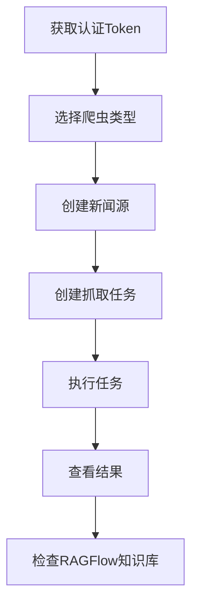

# 新闻收集器 API

基于RAGFlow SDK架构的新闻收集器，支持多种外部爬虫工具。

## 架构概述

```
新闻收集器 = 外部爬虫工具 + RAGFlow上传机制
```

### 组件结构

1. **抽象接口** (`api/interfaces/news_crawler_interface.py`)
   - 定义统一的爬虫接口规范
   - 包含数据结构：NewsSource、NewsArticle、CrawlTask等

2. **爬虫实现** (`api/crawlers/news_crawler_implementations.py`)
   - ScrapyNewsCrawler：基于Scrapy的爬虫
   - Newspaper3kCrawler：基于Newspaper3k的爬虫  
   - DemoCrawler：演示爬虫，生成示例数据

3. **SDK端点** (`api/apps/sdk/news_collector.py`)
   - 使用RAGFlow的@token_required认证
   - 提供REST API接口
   - 集成爬虫工厂模式

## API端点

# 新闻收集器 API 用户手册

基于RAGFlow SDK架构的新闻收集器，支持多种外部爬虫工具的集成。

## 🚀 快速开始

### 1. 基础配置
- **服务地址**: `http://localhost:9222`
- **API版本**: v1
- **认证方式**: Bearer Token (RAGFlow原生认证)

### 2. 获取认证Token
在RAGFlow管理界面中获取API Token，用于所有API请求的认证。

### 3. 基础测试
```bash
# 克隆项目后，在项目根目录运行
python test_news_api_simple.py
```

## 📚 架构概述

```
新闻收集器 = 抽象接口 + 爬虫实现 + RAGFlow集成
```

### 组件结构

1. **抽象接口层** (`api/interfaces/news_crawler_interface.py`)
   - 统一的爬虫接口规范 `INewsCrawler`
   - 标准数据结构：`NewsSource`、`NewsArticle`、`CrawlTask`、`CrawlResult`
   - 状态管理：`CrawlerStatus` 枚举

2. **爬虫实现层** (`api/crawlers/news_crawler_implementations.py`)
   - **DemoCrawler**：演示爬虫，生成真实新闻内容
   - **ScrapyNewsCrawler**：Scrapy框架集成（待实现）
   - **Newspaper3kCrawler**：Newspaper3k库集成（待实现）

3. **API接口层** (`api/apps/sdk/news_collector.py`)
   - 7个REST API端点
   - RAGFlow `@token_required` 认证集成
   - 爬虫工厂模式 `CrawlerFactory`

4. **数据存储层** (`api/db/db_models.py`)
   - `NewsSource`：新闻源信息
   - `NewsTask`：抓取任务管理  
   - `NewsContent`：新闻内容元数据

## 🌐 API端点详情

### Base URL
```
http://localhost:9222/api/v1
```

### 认证Header
```http
Authorization: Bearer <your_ragflow_token>
Content-Type: application/json
```

### 1. 服务状态检查
```http
GET /ping
```

**响应示例**：
```json
{
  "code": 0,
  "data": {
    "status": "running",
    "version": "2.0.0",
    "architecture": "external_crawlers",
    "tenant_id": "1d0aeb8863be11f085a815552a6f2001",
    "supported_crawlers": ["scrapy", "newspaper", "demo"],
    "timestamp": "2025-07-26T16:35:47.648299"
  },
  "message": "success"
}
```

### 2. 获取支持的爬虫类型
```http
GET /crawlers
```

**响应示例**：
```json
{
  "code": 0,
  "data": {
    "crawlers": [
      {
        "type": "demo",
        "description": "演示爬虫 - 生成示例新闻数据"
      },
      {
        "type": "scrapy", 
        "description": "Scrapy爬虫 - 适用于复杂网站爬取"
      },
      {
        "type": "newspaper",
        "description": "Newspaper3k爬虫 - 适用于新闻网站文章提取"
      }
    ],
    "total": 3
  },
  "message": "success"
}
```

### 3. 创建新闻源
```http
POST /sources
Content-Type: application/json

{
  "name": "新浪科技",
  "url": "https://tech.sina.com.cn/",
  "description": "新浪科技频道",
  "crawler_type": "newspaper"
}
```

**响应示例**：
```json
{
  "code": 0,
  "data": {
    "id": "abc123def456...",
    "name": "新浪科技",
    "url": "https://tech.sina.com.cn/",
    "description": "新浪科技频道",
    "crawler_type": "newspaper",
    "tenant_id": "1d0aeb8863be11f085a815552a6f2001",
    "created_at": "2025-07-26T16:35:47.693480",
    "status": "active"
  },
  "message": "success"
}
```

### 4. 创建抓取任务
```http
POST /tasks
Content-Type: application/json

{
  "task_name": "每日科技新闻收集",
  "kb_id": "4ad3c16669c211f0818e254379a07586",
  "crawler_type": "demo",
  "max_articles": 10,
  "sources": [
    {
      "name": "新浪科技演示",
      "url": "https://tech.sina.com.cn/"
    },
    {
      "name": "网易科技演示", 
      "url": "https://tech.163.com/"
    }
  ]
}
```

**参数说明**：
- `task_name`: 任务名称（必需）
- `kb_id`: RAGFlow知识库ID（必需）
- `crawler_type`: 爬虫类型，可选值：`demo`、`scrapy`、`newspaper`（默认：`demo`）
- `max_articles`: 每个源最大抓取文章数（默认：5）
- `sources`: 新闻源列表（必需）

**响应示例**：
```json
{
  "code": 0,
  "data": {
    "task_id": "8758c05869fb11f0a68b4b475b1291fe",
    "status": "created",
    "message": "任务创建成功"
  },
  "message": "success"
}
```

### 5. 执行抓取任务
```http
POST /tasks/{task_id}/execute
```

**响应示例**：
```json
{
  "code": 0,
  "data": {
    "task_id": "8758c05869fb11f0a68b4b475b1291fe",
    "status": "completed",
    "crawl_result": {
      "success": true,
      "crawler_type": "demo",
      "task_id": "875b0e6c69fb11f0a68b4b475b1291fe",
      "status": "completed",
      "total_articles": 6,
      "success_count": 0,
      "failed_count": 6,
      "skipped_count": 0,
      "output_directory": "/tmp/news_crawler_xxx",
      "error_message": null
    },
    "upload_result": {
      "success": true,
      "uploaded_files": 0,
      "files": []
    }
  },
  "message": "success"
}
```

### 6. 查询任务状态
```http
GET /tasks/{task_id}
```

**响应示例**：
```json
{
  "code": 0,
  "data": {
    "task_id": "8758c05869fb11f0a68b4b475b1291fe",
    "name": "演示任务_20250726_163547",
    "status": "completed",
    "created_at": "2025-07-26T16:35:47.693480",
    "statistics": {
      "total_articles": 6,
      "sources_processed": 0,
      "uploaded_files": 0
    }
  },
  "message": "success"
}
```

### 7. 获取任务列表
```http
GET /tasks?page=1&page_size=10
```

**查询参数**：
- `page`: 页码（默认：1）
- `page_size`: 每页数量（默认：10）

**响应示例**：
```json
{
  "code": 0,
  "data": {
    "tasks": [
      {
        "task_id": "8758c05869fb11f0a68b4b475b1291fe",
        "name": "演示任务_20250726_163547",
        "status": "completed",
        "created_at": "2025-07-26T16:35:47.693480",
        "sources_count": 2,
        "total_articles": 6
      }
    ],
    "total": 1,
    "page": 1,
    "page_size": 10
  },
  "message": "success"
}
```

## 🔧 支持的爬虫类型

| 类型 | 状态 | 描述 | 适用场景 |
|------|------|------|----------|
| `demo` | ✅ 已实现 | 演示爬虫，生成真实新闻内容 | 测试和演示 |
| `scrapy` | 🚧 待实现 | 基于Scrapy框架的爬虫 | 复杂网站结构爬取 |
| `newspaper` | 🚧 待实现 | 基于Newspaper3k的爬虫 | 新闻网站文章提取 |

### Demo爬虫特性
- 🎯 **智能内容生成**：根据新闻源名称生成对应领域内容
- 📰 **真实新闻格式**：包含完整的YAML frontmatter和Markdown正文
- 🏷️ **多源支持**：支持新浪科技、网易科技、36氪等不同风格
- 📝 **内容丰富**：每篇文章2000+字，包含标题、作者、分类、标签等元数据

## 📋 完整工作流程

### 1. 基本流程


### 2. Python示例代码
```python
import requests
import json

# 配置
API_BASE = "http://localhost:9222/api/v1"
TOKEN = "your_ragflow_token"
KB_ID = "your_knowledge_base_id"

headers = {
    "Authorization": f"Bearer {TOKEN}",
    "Content-Type": "application/json"
}

# 1. 检查服务状态
response = requests.get(f"{API_BASE}/ping", headers=headers)
print("服务状态:", response.json())

# 2. 创建抓取任务
task_data = {
    "task_name": "我的新闻任务",
    "kb_id": KB_ID,
    "crawler_type": "demo",
    "max_articles": 5,
    "sources": [
        {
            "name": "科技新闻",
            "url": "https://tech.example.com"
        }
    ]
}

response = requests.post(f"{API_BASE}/tasks", headers=headers, json=task_data)
task_id = response.json()["data"]["task_id"]
print("任务创建成功:", task_id)

# 3. 执行任务
response = requests.post(f"{API_BASE}/tasks/{task_id}/execute", headers=headers)
result = response.json()
print("执行结果:", result["data"]["status"])

# 4. 查询任务状态
response = requests.get(f"{API_BASE}/tasks/{task_id}", headers=headers)
status = response.json()
print("任务状态:", status["data"])
```

## 📄 文件输出格式

### Markdown格式示例
爬取的文章保存为标准Markdown格式，包含YAML前端元数据：

```markdown
---
title: "AI医疗技术实现新突破，智能诊断准确率提升30%"
url: "https://tech.sina.com.cn/#demo-1"
author: "新浪科技编辑部"
publish_time: "2025-07-26T16:35:47.123456"
category: "科技"
tags: ["人工智能", "医疗", "技术突破"]
summary: "AI医疗技术在诊断精度方面取得重大进展"
crawled_at: "2025-07-26T16:35:47.123456"
---

# AI医疗技术实现新突破，智能诊断准确率提升30%

## 技术背景

近日，人工智能在医疗领域的应用取得了重大突破...

## 市场前景

业内分析师认为，随着技术的不断成熟...

## 未来展望

专家预测，AI医疗技术将在以下几个方面实现重大突破：
1. 技术性能的显著提升
2. 应用场景的不断扩展
3. 成本的进一步降低
4. 产业生态的日趋完善
```

### 目录结构
```
/tmp/news_crawler_<task_id>/
├── sources/
│   ├── 新浪科技演示/
│   │   ├── AI医疗突破.md
│   │   ├── 5G网络建设.md
│   │   └── source_info.json
│   └── 网易科技演示/
│       ├── 云计算分析.md
│       ├── 新能源汽车.md
│       └── source_info.json
├── logs/
│   └── crawl.log
└── metadata.json
```

## 🛠️ 扩展新爬虫

要添加新的爬虫实现，请按以下步骤操作：

### 1. 实现抽象接口
```python
from api.interfaces.news_crawler_interface import INewsCrawler, CrawlTask, CrawlResult

class MyCustomCrawler(INewsCrawler):
    def validate_source(self, source: NewsSource) -> bool:
        """验证新闻源是否支持"""
        return True
    
    def crawl_articles(self, task: CrawlTask) -> CrawlResult:
        """执行爬取任务"""
        # 您的爬虫实现逻辑
        articles = []
        
        # 处理每个新闻源
        for source in task.sources:
            # 实现具体的爬取逻辑
            source_articles = self._crawl_single_source(source)
            articles.extend(source_articles)
        
        # 保存到文件
        self.save_articles_to_directory(articles, task.output_directory)
        
        return CrawlResult(
            task_id=task.task_id,
            status=CrawlerStatus.COMPLETED,
            total_articles=len(articles),
            success_count=len(articles),
            articles=articles
        )
    
    def get_supported_domains(self) -> List[str]:
        """返回支持的域名"""
        return ["example.com", "*.mydomain.org"]
```

### 2. 注册到工厂
```python
# 在 news_crawler_implementations.py 中添加
from your_module import MyCustomCrawler

# 注册到工厂
CrawlerFactory._crawlers["mycustom"] = MyCustomCrawler
```

### 3. 更新API信息
```python
# 在 get_crawler_types() 函数中添加
{
    "type": "mycustom",
    "description": "我的自定义爬虫 - 适用于特定网站"
}
```

## ⚠️ 注意事项

### 1. 权限要求
- 需要有效的RAGFlow认证Token
- 必须有对应知识库的访问权限
- 任务执行需要文件写入权限

### 2. 性能考虑
- 建议每个源的文章数量不超过100篇
- 大量任务请考虑分批执行
- 注意目标网站的访问频率限制

### 3. 错误处理
- API会返回详细的错误信息
- 建议实现适当的重试机制
- 任务失败时检查日志获取详细信息

### 4. 最佳实践
- 使用描述性的任务名称
- 定期清理已完成的任务
- 监控知识库存储空间使用情况
- 遵守网站的robots.txt规则

## 📞 技术支持

如遇到问题，请：

1. **查看日志**：检查RAGFlow服务日志
2. **运行测试**：使用 `test_news_api_simple.py` 验证基础功能
3. **检查配置**：确认Token和知识库ID正确
4. **参考文档**：详细技术文档请查看 `docs/NEWS_COLLECTOR_ARCHITECTURE.md`

---

**版本**: v2.0.0  
**最后更新**: 2025-07-26  
**兼容性**: RAGFlow >= 0.9.0

### 4. 创建抓取任务
```http
POST /news/tasks
Content-Type: application/json
Authorization: Bearer <your_token>

{
  "task_name": "每日科技新闻",
  "kb_id": "your_knowledge_base_id",
  "crawler_type": "newspaper",
  "max_articles": 10,
  "sources": [
    {
      "name": "科技媒体",
      "url": "https://tech.example.com"
    }
  ]
}
```

### 5. 执行抓取任务
```http
POST /news/tasks/{task_id}/execute
Authorization: Bearer <your_token>
```

### 6. 查询任务状态
```http
GET /news/tasks/{task_id}
Authorization: Bearer <your_token>
```

### 7. 获取任务列表
```http
GET /news/tasks?page=1&page_size=10
Authorization: Bearer <your_token>
```

## 支持的爬虫类型

| 类型 | 描述 | 适用场景 |
|------|------|----------|
| `demo` | 演示爬虫 | 测试和演示 |
| `scrapy` | Scrapy爬虫 | 复杂网站结构爬取 |
| `newspaper` | Newspaper3k | 新闻网站文章提取 |

## 工作流程

1. **选择爬虫类型**：根据目标网站选择合适的爬虫工具
2. **创建新闻源**：配置要爬取的新闻网站
3. **创建抓取任务**：指定知识库和爬取参数
4. **执行任务**：爬虫工具抓取内容并保存为Markdown文件
5. **自动上传**：将爬取结果上传到RAGFlow知识库

## 扩展爬虫

要添加新的爬虫实现：

1. 继承 `INewsCrawler` 接口
2. 实现必需的方法：
   - `validate_source()`
   - `crawl_articles()` 
   - `get_supported_domains()`
3. 在 `CrawlerFactory` 中注册新的爬虫类型

## 文件输出格式

爬取的文章保存为Markdown格式，包含：

- YAML前端元数据（标题、来源、发布时间等）
- Markdown正文内容
- 自动生成的文件名和目录结构

每个任务会创建独立的输出目录，便于管理和上传到RAGFlow知识库。
